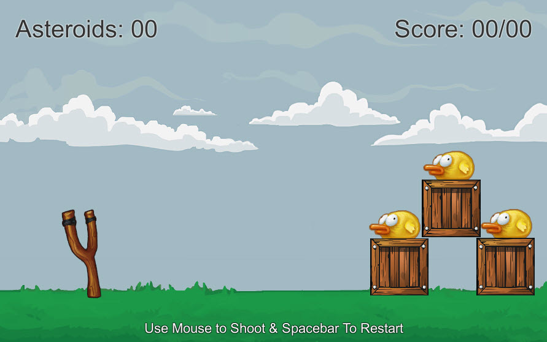
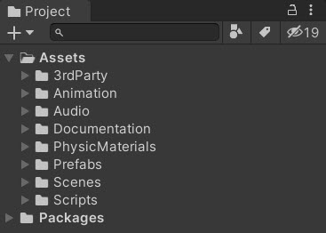
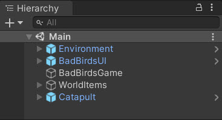

# Bad Birds

This game is a clone of a popular mobile game.

It showcases the basics of a complete 2D Physics game.

This serves as a learning example. <a href="https://Linkedin.com/in/SamuelAsherRivello">Contact Me</a> for personal/group tutoring.

Enjoy!

## Project

**Configuration**

* `Engine` - [Unity](https://docs.unity3d.com/) Game Engine
* `Unity Target` - Standalone MAC/PC
* `Unity Version` - Use this [Version](./client/ProjectSettings/ProjectVersion.txt) or above
* `Unity Rendering` - [Standard Render Pipeline (SRP)](https://docs.unity3d.com/Manual/built-in-render-pipeline.html)

**Screenshots**

Game View

Project View

Scene Hierarchy View

**Components**

* Rendering
* Audio
* Input (Mouse/Keyboard)
* Physics (Gravity/Collisions)
* Programming
* Game Design (Win/Loss)

Created By
=============

- Samuel Asher Rivello 
- Over 20 years XP with game development (2020)
- Over 8 years XP with Unity (2020)

Contact
=============

- Twitter - <a href="https://twitter.com/srivello/">@srivello</a>
- Resume & Portfolio - <a href="http://www.SamuelAsherRivello.com">SamuelAsherRivello.com</a>
- Git - <a href="https://github.com/SamuelAsherRivello/">Github.com/SamuelAsherRivello</a>
- LinkedIn - <a href="https://Linkedin.com/in/SamuelAsherRivello">Linkedin.com/in/SamuelAsherRivello</a> <--- Say Hello! :)

--
